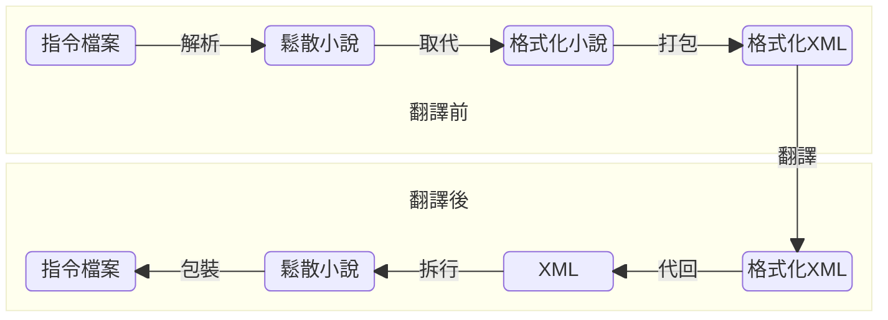

本文是之前處理某大型 RPG 翻譯的操作筆記。

# 模型選擇

由於我顯卡已經很舊了，所以只能選比較小的模型，最後選 `qwen2.5-7b-instruct-q4_k_m` 這個版本，模型可以在 [Hugging Face](https://huggingface.co/collections/Qwen/qwen25) 找到。

| 名稱       | 意義                                  |
| -------- | ----------------------------------- |
| qwen2.5  | 模型名稱 Qwen 2.5                       |
| 7b       | 70 億參數                              |
| instruct | 偏 instruct 版本（另一個版本是 think）         |
| q4_k_m   | 4-bit GGUF 量化方法，KM = K-quants 的一種變體 |

程式碼大概會長這樣：


from typing import *
from llama_cpp import Llama

llm = Llama(
    model_path   = "./models/qwen2.5-7b-instruct-q4_k_m-00001-of-00002.gguf",
    n_gpu_layers = -1, 
    n_ctx        = 2048,
    verbose      = False
)

def chat(prompts: str, settings: str) -> str:

    "Return AI chat result."
    
    output = llm.create_chat_completion([
        {"role": "system", "content": settings},
        {"role": "user",   "content": prompts}
    ])

    return output['choices'][0]['message']['content']



當然，需要安裝一下 `llama-cpp-python` 



# 預處理流程

經過調查，除了原本就做多國語言翻譯的遊戲，有特別準備多語言表外。很多遊戲，文字是隨地圖檔案分散到各處的，且對話在單個指令中不連續。

有鑑於此，我們先針對 RPG 遊戲做出以下假設：

- **同一調用事件，對話應該是連續的**
    - 也就是說 A 調用對話指令，把話講一半；突然 B 調用，然後把後面的話講完，這個狀況假設不存在。實務上，同一位角色的對話確實有可能觸發來源不同，但通常還是會讓同一個來源完成對話主題。
    - 這一假設，也刪去了對話跨地圖的可能性。
- **對話包含一些專有名詞、跳脫指令**
    - 專有名詞：人名、地名等等，不解釋
    - 跳脫指令：像是「\.」在 RPG Maker 中用來「停頓」之類的，其實很多對話中都會插入這種指令，來增加語氣效果。

所以整個流程大致上設計（格式意義後面介紹）：


注意，這個翻譯前後的處理邏輯不是完全對稱的。  
由於「多行打包」後，重新拆行涉及斷詞，而純文本跟 XML 混合的內容，斷詞長度不好控制，所以優先將專有名詞跟指令換回後，才斷詞。


## 指令檔案

通常是包含在地圖檔案中，有時候會用「編號」取代實際文本，然後獨立一個多國語言翻譯檔案，這樣的話，處理起來就簡單一點。舉例來說：


[
	{
	  command: "...",
	  speaker: "男人"
	  text: "下雨了，\."
	},
	{
	  command: "...",
	  speaker: "男人"
	  text: "我們得回格林公國找把"
	},
	{
	  command: "...",
	  speaker: "男人"
	  text: "傘。"
	}
	...
]


## 鬆散小說

也就是把指令檔案拆成下面這個狀態，這一步通常是簡單轉換：


男人: 下雨了，\.
男人: 我們得回格林公國找把
男人: 傘。


## 格式化小說

這邊要引入兩個檔案，並且「取代」成特定格式。我這邊以 XML 為主，因為 AI 比較能識別 XML 標籤並保留原始內容。

- 專有名詞對應表（用以確定專有名詞的翻譯不會跑掉），例如：
    
    1, Duchy of Green, 格林公國
    
    
    轉換成：
    
    
    <proper id="1" />
    
- 系統指令對應表（把指令狀態固定下來），例如 RPG Maker 的指令：
    
    \c[?] 改變字體顏色
    \s[?] 改變字體大小
    \v[?] 取代為變數
    \. 停頓 0.5 秒
    \.. 停頓 1 秒
    \! 等待玩家按下
    \^ 不等待玩家
    ...
    
    
    實際轉換是：
    
    
    <command id="1" color="?" />
    <command id="2" size="?" />
    ...
    <command id="4" wait="500" />
    ...
    
    
    
    筆者實驗過後發現用 ID 的效果比較好，可能還需要多嘗試。
    
    

取代完成後：


男人: 下雨了，<command id="4" wait="500" />
男人: 我們得回<proper id="1" />找把
男人: 傘。



其實「合併多行（下一步）」跟「取代專有名詞、指令」是可以交換的。  
但注意，由於分詞系統的差異，有可能會誤解析。所以這裡筆者利用原始作者的分行，確保指令、專有名詞在合併前就已經被代換。

下面舉一個可能會出問題的例子：


NPC: 格林
NPC: 王國不也出兵了嗎？


如果先合併的話：


NPC: 格林王國不也出兵了嗎？


有可能導致把兩種專有名詞混淆（人名、國名）等等。更麻煩的是，有些作者會加入一些奇怪的符號，導致出錯，例子：


NPC: /_>\
NPC: ...不是這個意思。


合併後出錯，注意這裡的 `\.` 可能與「停頓指令」衝突：


NPC: /_>\...不是這個意思。


合併行前代換，其實是「利用作者換行的資訊」來提升精準度。


程式碼大概是：


def format(origin: str, propers: List[Any]) -> str:

    """
    Replace proper to xml-style tags
    """

    for proper in propers:
        id          = proper['id']
        category    = proper['category']
        target      = proper['origin']

        if category == 'command':
            origin = origin.replace(target, f"<{category} id='{id}'>")
        else:
            gender = proper['gender']
            plural = proper['plural']
            origin = origin.replace(target, f"<{category} id='{id}' gender='{gender}' plural='{plural}'>")

    return origin


## 合併 XML 格式

最後一步，為了提高資訊密度（合併上下文，可以讓 AI 翻譯更準確），需要把多行壓縮起來，由於之後還要恢復，所以需要打一個標記。


<pack line=3>
	<speaker>男人</speaker>
	<text>下雨了，<command id="4" wait="500" />我們得回<proper id="1" />找把傘。</text>
</pack>



經過實驗，我發現純粹的 `(3)` 可能是不管用的，例如：  

(3) 男人: 下雨了，<command id="4" wait="500" />我們得回<proper id="1" />找把傘。



程式碼大概是：


def pack(origin: str, colon: str) -> str:

    origin = origin.replace('\r\n', '\n')
    lines  = origin.split('\n')
    
    scripts = []
    for line in lines:
        if line.strip() != '':

            parts = line.split(colon)
            name  = parts[0].strip()
            text  = parts[1].strip()

            if len(scripts) > 0 and name == scripts[-1]['name']:
                scripts[-1]['text'] += text
                scripts[-1]['line'] += 1
            else:
                scripts.append({
                    'name': name,
                    'text': text,
                    'line': 1
                })

    res = ""
    for script in scripts:
        name = script['name']
        text = script['text']
        line = script['line']
        res += f"<pack line='{line}'>{name}{colon}{text}</pack>"

    return res


# AI 翻譯

AI 翻譯很方便，但由於以下限制：

1. AI 總有機會出錯
2. AI 對於同樣的輸入，會給同樣的輸出
3. 個人電腦的顯卡 token 數有限

基於以上三點，當 AI 模型出錯時（by 1），若直接引入歷史對話流，會導致 token 無法容納（by 3），又因為同輸入會得到同結果（by 2）。

所以，我的 prompts 採用以下方案：


You should translate the HTML to English, but keep HTML tag information. (<retry_number>)


在 system role 的 prompts 中，插入嘗試次數，來作為亂數改變模型輸出。然後，在 `try...catch...` 中，按流程逐步解回指令檔案，如果失敗，就當作 AI 模型出錯，我們重新生成翻譯：


def translate(origin: str, 
              propers: List[Any], 
              colon: str = ': ',
              line_splitter: Callable = en_line_splitter,
              settings: str = "You should translate the HTML to English, but keep HTML tag information.",
              retry: int = 3) -> str:

    "Return a translation from origin with propers."

    # Insert colon to propers
    propers.append({
        'category': 'command',
        'origin': colon,
        'translation': colon,
    })

    id = 0
    for proper in propers:
        proper.update({'id': id})
        jieba.add_word(proper['origin'], freq=0x7fffffff)
        jieba.add_word(proper['translation'], freq=0x7fffffff)
        id += 1

    formated_colon = format(colon, propers)

    # Preprocess original text
    origin = format(origin, propers)
    origin = pack(origin, formated_colon)

    # Try to translate original text
    while retry > 0:
        try:
            translation = chat(origin, settings + f"({retry})")
            translation = deformat(translation, propers)
            translation = depack(translation, colon, line_splitter)
            
            if re.search(r'<[^>]+>', translation):
                raise RuntimeError('Found XML tag')

            break # Ok

        except:
            print(f"Translation Failed: {settings} ({retry})\n{origin}", flush=True)
            retry -= 1

    if retry == 0:
        print(f"Translation Failed: End", flush=True)

    return translation


# 後處理流程

翻譯完成（實際上，我們是透過一邊逆處理、一邊確定 AI 輸出正確的），但這裡會介紹中間兩行的細節：


translation = deformat(translation, propers) # 解專有名詞
translation = depack(translation, colon, line_splitter) # 重新拆行


假設翻譯後：


<pack line=3>
	<speaker>Man</speaker>
	<text>It's raining, <command id="4" wait="500" />we need to head back to <proper id="1" /> to find an umbrella.</text>
</pack>


## 解專有名詞與指令

這一步不複雜，重新查詢即可：


def deformat(translation: str, propers: List[Any]) -> str:

    """
    Replace xml-style tags to proper
    """

    for proper in propers:
        id       = proper['id']
        category = proper['category']
        target   = proper['translation']

        if category == 'command':
            translation = translation.replace(f"<{category} id='{id}'>", target)
        else:
            gender = proper['gender']
            plural = proper['plural']
            translation = translation.replace(f"<{category} id='{id}' gender='{gender}' plural='{plural}'>", target)

    return translation


解出來後：


<pack line=3>
	<speaker>Man</speaker>
	<text>It's raining, \.we need to head back to Duchy of Green to find an umbrella.</text>
</pack>


## 重新拆行

注意原本的 RPG 指令數量是固定的，又因為這些 RPG 可能會搭配文字顯示來展示圖片。

這意味著，我們必須維持原本「指令的數量」，這也是為什麼，我們需要整合翻譯（為了上下文完整性）又需要拆行（維持指令數量相同）的原因。

原則上，要讓詞均勻分佈在每一行中，所以：

- 如果目前行數「高於」目標，則找到最短的兩行合併
- 如果目前行數「少於」目標，則找到最長的行拆分

記得，實際上是以詞為單位，拆程多行：


def depack(translation: str, colon: str, line_splitter: Callable) -> str:

    def restore(match):
        target  = int(match.group(1))
        message = match.group(2)
        parts   = message.split(colon)
        name    = parts[0].strip()
        text    = parts[1].strip()

        res   = []
        lines = line_splitter(text, target)
        for line in lines:
            res.append(f"{name}{colon}{line}")
        return f"{'\n'.join(res)}\n"

    res = re.sub(r"<pack line='(\d+)'>(.*?)</pack>", restore, translation)
    res = res[:-1] # remove end \n
    return res


分詞部份，中、英文有差異，這裡以英文為例：


def en_line_splitter(text: str, line_count: int) -> List[str]:

    pattern  = r'([^.,!?:;\n]+[.,!?:;\n]*)'
    segments = re.findall(pattern, text)
    chunks   = [s.strip() for s in segments if s.strip()]
    
    while len(chunks) != line_count:

        if len(chunks) > line_count:
            
            min_combined_index  = 0
            min_combined_length = len(text)
            for i in range(0, len(chunks) - 1):
                if len(chunks[i]) + len(chunks[i + 1]) < min_combined_length:
                    min_combined_index  = i 
                    min_combined_length = len(chunks[i]) + len(chunks[i + 1])

            chunks[min_combined_index] += chunks[min_combined_index + 1]
            chunks.pop(min_combined_index + 1)

        if len(chunks) < line_count:

            max_splitted_index  = 0
            max_splitted_length = 0
            for i in range(0, len(chunks)):
                if len(chunks[i]) > max_splitted_length:
                    max_splitted_index  = i 
                    max_splitted_length = len(chunks[i])

            min_combined_index  = 0
            min_combined_length = 0
            words = chunks[max_splitted_index].split(' ') # 中文此行不同
            for i in range(0, len(words)):
                if abs(len(words[:i]) - len(words[i:])) < min_combined_length:
                    min_combined_index  = i 
                    min_combined_length = abs(len(words[:i]) - len(words[i:]))

            chunks[max_splitted_index] = ' '.join(words[:min_combined_index])
            chunks.insert(max_splitted_index + 1, ' '.join(words[min_combined_index:]))

    return chunks



中文可以用 `jieba.lcut` 來分詞。



# 本文完成前的雜記

- 不連續的主劇本是因為「有限的顯示空間」或是「演出」拆台詞，然後本地化文件跟拆句對應。
- 直接翻譯本地化文件，會導致遺漏上下文。所以必須翻譯主劇本。翻譯後的主劇本，不能按原本的方式一一拆分回本地化文件，需要按句子數目拆分（原本拆 4 句，翻譯完成也必須拼回 4句）。
- 需要保留對應文字指令、專有名詞，要先轉換成不易誤會的標記，通常是 `<tag>` 等 XML 格式。
- 應該是這樣處理：
    
    <!--原文-->
    羊羽: 下雨了，\!
    羊羽: 我們得去找把
    羊羽: 傘。
    
    <!--拼合-->
    羊羽：下雨了，\!我們得去找把傘。(3)
    
    <!--代換-->
    <term gender='male' plural='false'>：下雨了，<cmd id='1'>我們得去找把傘。(3)
    
    <!--AI 翻譯-->
    <term gender='male' plural='false'>: It's raining, <cmd id='1'>we've to find an umbrella.(3)
    
    <!--回換-->
    YangYu: It's raining, \!we've to find an umbrella.(3)
    
    <!--拆句-->
    YangYu: It's raining, \!
    YangYu: we've to find
    YangYu: an umbrella.
    

